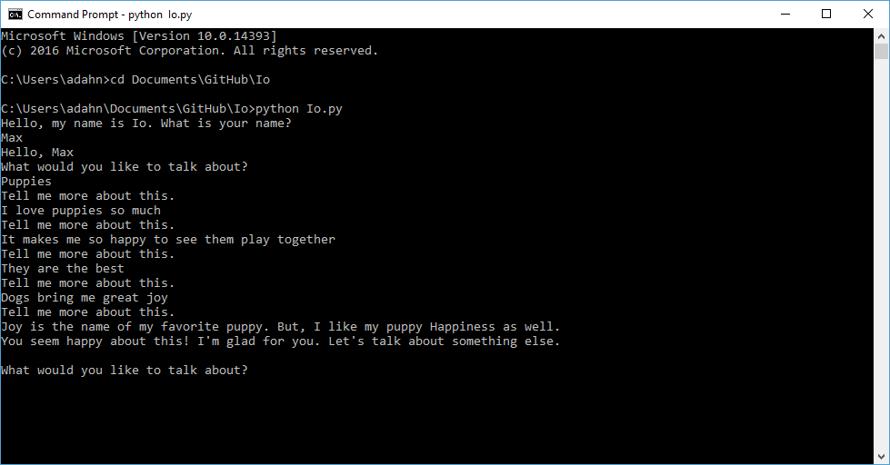

#Io

This project aimed to use the Watson Tone Analyzer API in order to create a basic conversation bot that can analyze user input for basic tones.

Time spent: 2.5 hours

The original list of minimum requirements was:
- Use Python
- Invoke the Watson Tone Analyzer API
- Read user input
- Prompt appropriately for more input
- If confident in the emotional tone of a topic, remark on the tone
- If not confident in the emotional tone after 5 inputs on a topic, move on to new topic

The key challenges identified were:
- Python input parsing
- Watson Tone Analyzer API interactions
- Branching conversation logic

The following improvements were stretch goals:
- Tailor response based on social tone
- Tailor response based on language tone
- Improve personality 

During the project, we discovered several cool improvements:
- Storing API credentials in a JSON file excluded from the repository, in order to protect credentials
- Storing debug test responses in a JSON file so they wouldn't have to be typed repeatedly
- Managing logic for JSON response loading vs input prompting for proper best coding practices 

We also found a few difficulties:
- Watson tone analysis is a bit tone deaf
- Difficult to determine what changes Watson's opinion of tone

Example:

