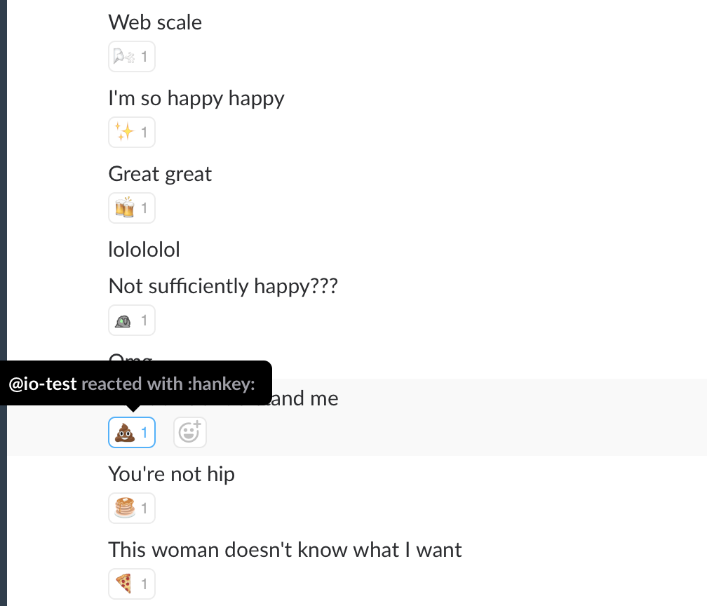

# 100Bot

This is a son-of-[IoBot](https://github.com/adahn6/Io) project, taking the best
things about Io and turning them into a monster.

A picture is worth 1000 words:



100Bot is powered by the Watson Tone Analyzer service. Each message is carefully
parsed for emotional significance and response, so that the perfectly
appropriate reaction emoji can be chosen.

## Running 100Bot

The bot requires three very specific parameters:
 - A Watson Tone Analyzer `username` credential
 - A Watson Tone Analyzer `password` credential
 - A Slack Integration Token for a bot

### Running with docker-compose

The easiest way to get 100bot up and running with dependencies is by using the docker service file included: `docker-compose.yml`. Modify the supplied `.env-sample` to provide credentials for the Watson Tone Analyzer and a Slack bot. Then build and start the service with:

```shell
docker-compose up -d
```


### Running natively with python

Pip modules `slackclient` and `requests` must be installed. Use virtualenv to make your life easier. Passing of credentials can be done with argparse:

```shell
python3 100bot.py \
 --bx-username "user" \
 --bx-password "verysecret" \
 --slack-token "xoob-137138657231-2ReKEpxlvWwe6vDBripOs7sR"

```

but can also be done with environment variables:

```shell
export BLUEMIX_USERNAME=user
export BLUEMIX_PASSWORD=verysecret
export SLACK_TOKEN="xoob-137138657231-2ReKEpxlvWwe6vDBripOs7sR"
python3 100bot.py

```

(yes, these are all fake credentials don't try them...)